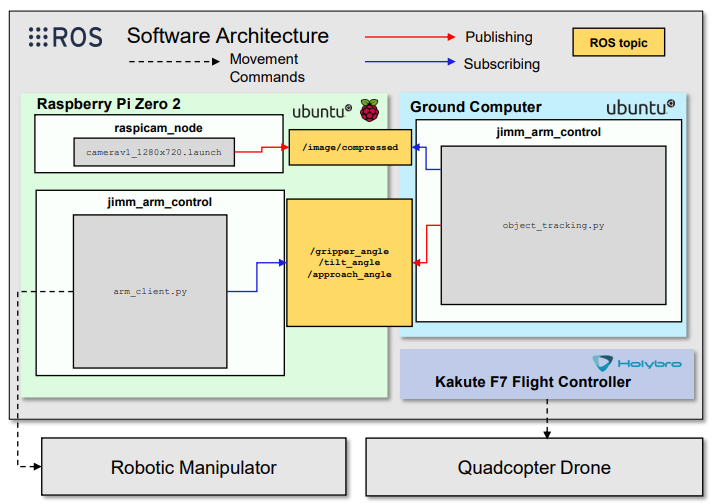
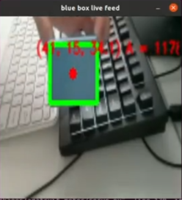

# ROSUAM
## Description
This GitHub repository documents a Winter 2022 Mechanical Engineering capstone project at Ryerson University describing the design, simulation, and construction of an unmanned aerial manipulator (UAM). In this repo you will find information on our project, the ROS software architecture and code, Gazebo simulation files, and CAD files for 3D printing. 

This work represents the efforts of the following individuals over a three-month period: Jill Aghyourli Zalat, Muhammad Ali, Isaac Correa, and Matthew Drummond-Stoyles.

## Hardware Used
### Drone
A [Kakute-F7](http://www.holybro.com/product/kakute-f7-aio-v1-5/) flight controller is used for manual control of the drone. 

### Arm
A [Raspberry Pi Zero 2](https://www.raspberrypi.com/products/raspberry-pi-zero-2-w/) is used as the onboard computer. To run ROS and interface with the ground computer, we decided to install Ubuntu Server on the Pi (Ubuntu running on a command line) as opposed to operating it using Raspian. Instructions for doing so can be found [here](https://ubuntu.com/tutorials/how-to-install-ubuntu-on-your-raspberry-pi#1-overview).

For image recognition, a [Raspberry Pi Camera v1.3](https://projects.raspberrypi.org/en/projects/getting-started-with-picamera) was used.

For control of three servo motors mounted on the arm, the [PCA9685 servo driver board](https://www.amazon.ca/SunFounder-PCA9685-Channel-Arduino-Raspberry/dp/B014KTSMLA/ref=sr_1_6?crid=3QD2Z1HIESGEN&keywords=pca9685&qid=1649836331&sprefix=pca9%2Caps%2C114&sr=8-6) was used.
## CAD files for 3D printing
Most parts were 3D printed on an Ender 3 Pro using PLA filament, including the arm links, gripper, drone-to-arm interface, drone legs, and drone guards. CAD files for 3D printing, as well as for viewing the whole assembly, can be found in the folder "CAD Files".

## Software Architecture
### Drone
[Ardupilot](https://ardupilot.org/) was chosen to run on the drone flight controller. Due to time constraints, the drone was only able to be controlled manually.

### Arm
The arm control is run jointly via the ground computer and the robotic arm using a ROS architecture, which can be seen below.

To run ROS, ROS Noetic (ROS-Base installation) was installed on both the ground computer and the Raspberry Pi, using [these instructions](http://wiki.ros.org/noetic/Installation/Ubuntu).

When ROS is set up, the IP addresses should be configured on both the Pi and computer. For this project, it was chosen that the Pi is the ROS Master. To set this up, run the following code.

On the **computer**: 
1. `nano ~/.bashrc`
2. Scroll to the end of the file (can be done using CTRL+END). Add or edit the following lines: `export ROS_MASTER_URI=http://PI_IP_ADDRESS:11311`, `ROS_IP=COMPUTER_IP_ADDRESS`, `ROS_HOSTNAME=COMPUTER_IP_ADDRESS`
3. Save the file and exit, then run `source ~/.bashrc`.

On the **Pi**: 
1. `nano ~/.bashrc`
2. Scroll to the end of the file (can be done using CTRL+END). Add or edit the following lines: `export ROS_MASTER_URI=http://PI_IP_ADDRESS:11311`, `ROS_IP=PI_IP_ADDRESS`, `ROS_HOSTNAME=PI_IP_ADDRESS`
3. Save the file and exit, then run `source ~/.bashrc`.

You can find out the IP address of the computer or Pi by running `ifconfig` in a terminal.
#### Arm control instructions
In one terminal **on the Pi**:
1. Clone [raspicam_node](https://github.com/UbiquityRobotics/raspicam_node) into `catkin_ws/src`: `git clone https://github.com/UbiquityRobotics/raspicam_node`
2. `cd ..`
3. `source devel/setup.bash`
4. `catkin_make`
5. Run a launch file for `raspicam_node` (parameters might need to be adjusted if there is high delay in the camera feed): `roslaunch raspicam_node camerav1_1280x720.launch`

To ensure the camera is working, run the roslaunch command given in Step 4 on the Pi, then on the ground computer run the following command: `rqt_image_view`. The rqt_image_view should open showing the live camera feed. 

In another terminal **on the Pi**:
1. Ensure the PCA9685 servo driver module is wired up to the Pi properly, then [enable I2C on the Pi](https://medium.com/vacatronics/getting-started-with-raspberry-pi-i2c-and-ubuntu-server-eaa57ee0baf2).
2. [Install Adafruit's PCA9685 servo driver library](https://learn.adafruit.com/adafruit-16-channel-servo-driver-with-raspberry-pi/using-the-adafruit-library). Run the test code given in the link to ensure everything is functional. You should see the servo motors move when running the code.
3. Ensure the folder `jimm_arm_control` is in the `catkin_ws/src` directory, and you ran `catkin_make` and `source devel/setup.bash` in the `catkin_ws` directory. 

On the **ground computer**:
1. Ensure the folder `jimm_arm_control` is in the `catkin_ws/src` directory, and you ran `catkin_make` and `source devel/setup.bash` in the `catkin_ws` directory. 
2. Ensure [OpenCV is installed](https://pypi.org/project/opencv-python/).
3. In a terminal, run the following code: `rosrun jimm_arm_control object_tracking.py`. After a few moments the camera feed should open up. When the payload is moved closer to the camera, a green contour is drawn, and the coordinates of the object center as well as its area are printed in red. 

In another terminal **on the Pi**:
1. Run the following command: `rosrun jimm_arm_control arm_client.py`. 

Now the arm servos should move in response to the payload seen in the image feed.

## Gazebo simulation

